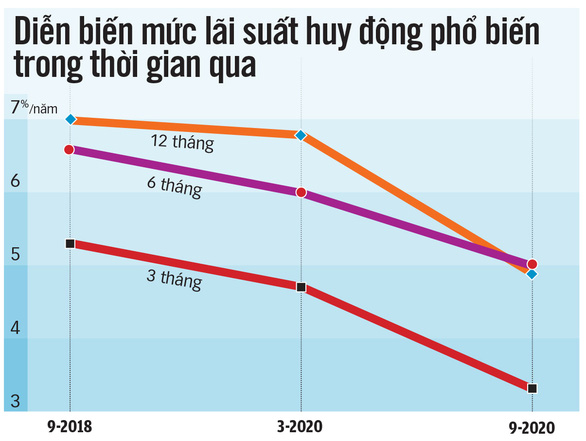
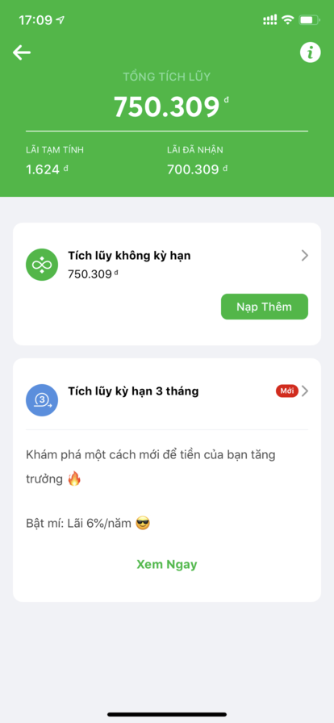
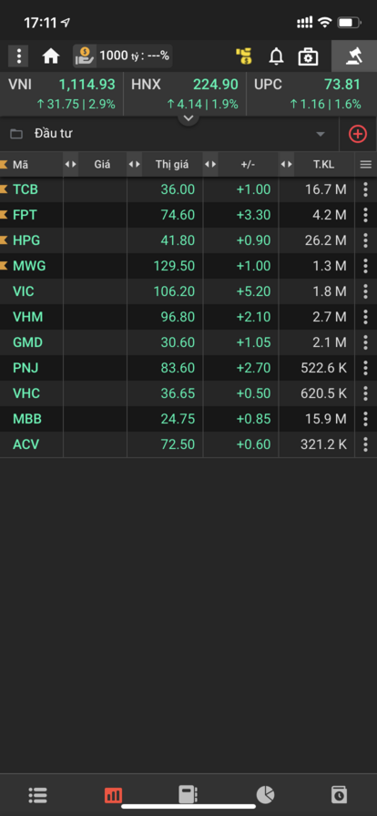
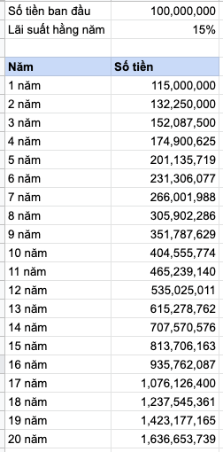

Trước hết, ta thử tìm hiểu **tiền** là gì nhé? Tiền là vật ngang giá chung để trao đổi hàng hóa và dịch vụ. Nói dễ hiểu là, bạn muốn mua một hàng hóa, bạn cần có tiền. Giá trị hàng hóa càng cao thì bạn cần có nhiều tiền. 💰💰💰

Khi giá trị của hàng hóa ngày càng tăng cao theo thời gian dẫn đến sức mua của đồng tiền càng lúc giảm đi, một đơn vị tiền tệ sẽ mua được ít hàng hóa và dịch vụ hơn so với trước đây, người ta gọi đó là **lạm phát** (inflation). Ví dụ:

- Ngày 01/01/2020 bạn có 100.000VNĐ, lạm phát bình quân ở Việt Nam mỗi năm là ~4%
- Như vậy, vào ngày 01/01/2021, giá trị thực (sức mua) của tờ tiền 100.000VNĐ là 96.000VNĐ.
- Nhưng nếu là sau đó 10 năm (01/01/2030), giá trị thực chỉ còn lại là 100000 \* (0.96)^10 = **66.483VNĐ**. 🥲

Vậy làm sao để tiền không mất đi giá trị? <mark>Hãy đầu tư</mark>.\
**Đầu tư tài chính** là đặt tiền vào một tài sản với kỳ vọng giá trị tài sản sẽ tăng lên trong tương lai (thường là dài hạn). Tùy vào khẩu vị rủi ro của mỗi người mà có rất nhiều kênh lựa chọn để đầu tư: vàng, bất động sản, cổ phiếu, trái phiếu, chứng chỉ quỹ, đồng tiền kỹ thuật số...

## Có nên gửi tiết kiệm ngân hàng không?

Ở Việt Nam, việc có một ngân hàng tuyên bố phá sản thì gần như là không thể (nhưng luật vẫn cho phép) vì đã có Chính phủ và Ngân hàng Nhà nước sẽ tìm cách giải quyết nên có thể thấy gửi tiết kiệm tại ngân hàng là một kênh đầu tư có độ an toàn cao.

Covid-19 đã tác động lớn tới kinh tế trong năm vừa rồi, các ngân hàng liên tục giảm lãi suất huy động nhằm mục đích là giảm lãi suất cho vay để đồng hành cùng các doanh nghiệp / khách hàng vượt qua khó khăn. Một lý do khác là các Chính phủ liên tục bơm tiền vào nền kinh tế, dẫn đến ngân hàng đang dư thừa về thanh khoản.

Hiện tại lãi suất trung bình của kỳ hạn 12 tháng ở các Ngân hàng chỉ còn khoảng 6.5%/năm và nếu trừ đi lạm phát 4% hằng năm nữa thì lãi suất thực chỉ còn 2.5%/năm.

Với mức lãi suất thực như hiện tại cộng thêm việc mình muốn trải nghiệm nhiều đầu tư kênh khác thì mình tạm bỏ qua kênh gửi tiết kiệm ở ngân hàng. 👋

Trước đây khi mình tìm hiểu về đầu tư thì có phát hiện ra Finhay - một fintech startup của Việt Nam và đã được cấp phép hoạt động.

- Finhay cho bạn gửi tiết kiệm trên app với lãi suất cam kết là **5%/năm KHÔNG KỲ HẠN**. Mình nhấn mạnh là không kỳ hạn, tức là bạn có thể bỏ tiền vào Finhay hôm nay và ngày mai rút ra thì lãi suất vẫn được tính trên số tiền đó với mức 5%/năm.
- Ngoài ra trên Finhay, bạn còn có thể
  - Đầu tư (mua chứng chỉ quỹ)
  - Đầu tư Cửu Long với lãi suất 9%/năm (lâu lâu mới mở)
  - Gần đây nhất là Tích lũy 3 tháng với lãi suất 6%/năm
  - Và có cả hoàn tiền khi mua sắm online trên Tiki, Shopee, Lazada,... nữa nhé.

👏 Tóm lại, nếu bạn đang bắt đầu tìm hiểu về đầu tư tài chính thì mình highly recommend sử dụng Finhay. Mình không có nhận được tài trợ từ Finhay nên nhá nhá vậy thôi, để tải Finhay thì các bạn click vào đường dẫn này đăng kí và nhận 5000đ ref nhé: https://finhay.com.vn/invite/XdCwy0 👏

## Các kênh đầu tư mình đang tham gia

### 1. Cổ phiếu

Đây là kênh đầu tư có mức **rủi ro cao**, đòi hỏi nhà đầu tư có kiến thức về tài chính, tuy nhiên là tỉ suất sinh lời tốt.

Quan điểm của mình là khi mua cổ phiếu tức là mình đang sở hữu công ty đó. Mình cần tìm hiểu thật kĩ về hoạt động của công ty, đọc báo cáo tài chính, biết về Ban Lãnh đạo, điểm nổi trội so với các công ty cùng ngành khác.

Dòng tiền để đầu tư cổ phiếu phải là số tiền nhàn rỗi ít nhất một năm vì trong ngắn hạn thị trường sẽ biến động rất nhiều, hôm nay tăng trần nhưng ngày mai có thể giảm sàn, nhưng nhìn chung nếu bạn sở hữu các cổ phiếu tốt thì sau một năm phần lãi thường cao hơn lãi suất ngân hàng nhiều. 🥳

### 2. Chứng chỉ quỹ

Hiểu nôm na là khi bạn mua chứng chỉ quỹ thì có nghĩa là bạn đưa số tiền của mình cho những chuyên gia tài chính ở công ty quỹ đi đầu tư giúp bạn. Tuy nhiên **đây không phải là gửi tiết kiệm**, sẽ có lời & lỗ tùy vào hoạt động mỗi quỹ và tình hình thị trường chung. Việc của bạn là có chút kiến thức về tài chính, sau đó là tìm hiểu độ uy tín, mức lợi nhuận hằng năm, phí mua bán của quỹ để chọn ra một quỹ phù hợp. Cái này cũng đau đầu lắm vì số lượng quỹ ở Việt Nam cũng lên tới hàng chục rồi. 🙄

[TCBS](https://www.tcbs.com.vn/home) (Công ty Chứng khoán của Ngân hàng Techcombank) có 3 quỹ mở là: Quỹ Trái phiếu (TCBF), Quỹ Linh hoạt (TCFF) và Quỹ cổ phiểu (TCEF). Mình chọn gửi quỹ ở TCBS thay vì gửi tiết kiệm vì thường lãi suất các quỹ mang lại sẽ cao hơn lãi suất ngân hàng (8-10%/năm) và mức độ rủi ro cũng không quá cao.

👏 Nếu bạn muốn tìm hiểu và tham gia đầu tư chứng khoán thì có thể mở ngay một tài khoản TCBS tại đây: https://iwp.tcbs.com.vn/105C292364 (100% online nha) 👏

> 📣 **Disclamer:** Mình không phải nhà môi giới của bất cứ sàn / ứng dụng nào, mình chỉ chia sẻ những kinh nghiệm của mình trong quá trình đầu tư. Nếu bạn có nhã hứng trò chuyện về đầu tư thì có thể contact với mình, thông tin mình để ở trang [/about]().

## Các điều cần lưu ý khi đầu tư tài chính

- Đừng bao giờ đầu tư vào những gì bạn không hiểu rõ.
- Lợi nhuận lớn luôn đi kèm với rủi ro cao. Hãy cẩn trọng.
- Xây dựng một phương pháp đầu tư bài bản và không ngừng cải tiến.
- Đặt kì vọng tỉ suất lợi nhuận vừa phải, với mình là 15%/năm.
- Lãi kép là kỳ quan thứ 8 của nhân loại.

Đây là một bảng tính lãi kép với số tiền đầu tư ban đầu là 100 triệu đồng, lãi suất thực mỗi năm là 15%. Sau 20 năm thì ta đã có 1,6 tỷ. 🤑

