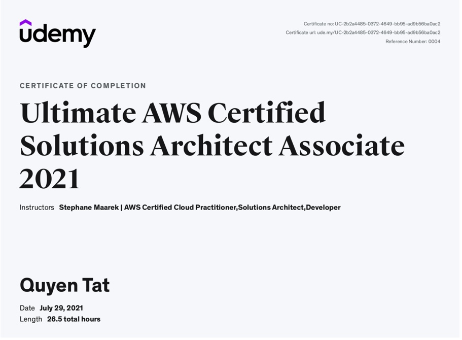

Nhật ký cách ly ngày thứ... à thôi bỏ đi, số ngày cách ly giờ chắc cũng không còn quan trọng 🥲. Hôm nay đã là ngày 31/07/2021 rồi, thế là đã 7 tháng trong năm 2021 trôi qua, mình muốn viết bài này để review lại để xem bản thân đã làm ăn được gì rồi. 👻

## Code nhiều hơn
- Từ khi nghỉ việc tại công ty và trở thành một full-time freelancer, mình nhận ra kiến thức của mình chỉ là một hạt cát giữa biển, hầu như khi nhận một dự án mới thì mình phải dành hàng giờ để nghiên cứu rồi thực hành. Thậm chí có những công nghệ mình đã làm qua rồi, nhưng khi quay lại đọc docs thì như một thế giới mới. 👀
- Một vài stacks mình học trong thời gian vừa rồi gồm có: MERN stacks, GraphQL, TypeScript, Docker, K8S,...
- Àh mình cũng đang tìm đồng đội để học chung và cùng nhau làm một vài pet projects nhỏ nhỏ up lên [Github](https://github.com/tvqqq) nè. 🤜🤛

## Khóa học AWS Certified Solutions Architect Associate
- ☁️ sẽ là một trong những yêu cầu trong ngành lập trình những năm tới. Càng ngày càng có nhiều công ty, dự án chuyển đổi mô hình từ On-Premise lên Cloud.
- Mình cũng đã làm việc với một số services của AWS được gần một năm nay và có thể cảm nhận được sự "bá đạo" của Cloud. Thay vì trước đây, mọi thứ đều phải "tới công chuyện" tự vận hành, tự mua server và chạy bằng cơm thì nay Cloud đã giúp chúng ta lo về phần cứng đó, việc còn lại là monitor hệ thống để phát hiện lỗi và chủ động scale lên khi có traffic lớn như các dịp campaign. 
- Hơn thế nữa, các Cloud Provider còn mang tới khái niệm **"serverless"**, có nghĩa là code của bạn chạy mà không cần server 🥸. Nhưng không hẳn là vậy, chỉ là phần server sẽ do các Cloud Provider như AWS phụ trách hoàn toàn, họ sẽ setup server để làm sao có thể match được với requirement của dự án và bạn chỉ cần trả tiền cho thời gian sử dụng service (nếu không dùng thì sẽ không bị tính bill). Điều này cũng là một con dao hai lưỡi, nó có thể rất chi là kinh tế cho một start up giai đoạn ban đầu, nhưng khi dự án scale lên rồi thì bill cũng tăng lên lắm đấy. Anyway, think big and start small. 💪
- Với những điều thú vị mà Cloud mang lại, mình đã đăng kí khóa học [Ultimate AWS Certified Solutions Architect Associate 2021](https://www.udemy.com/share/102CZ72@PkdgV0tgWlYOdk9HBHR1fj1HY1RiYA==/) trên Udemy. Sau khi hoàn thành khóa học, mình đã củng cố lại kiến thức về AWS và biết thêm rất rất nhiều các services khác. Giờ thì là thời gian để mình ôn luyện, tập giải đề rồi đợi hết giãn cách sẽ đi thi thôi (hy vọng là pass chớ phí thi cũng cao đó 🙏).

## Chứng khoán không dễ ăn đâu
- Tháng 7 rồi thực sự là một cú tát để mình tỉnh ngộ về "sự mộng mơ" trong đầu tư chứng khoán. Chỉ trong vài ngày tài khoản mình đã từ xanh thành đỏ và cứ thế là xa bờ...
- Mình đã phải xóa app để không bị ảnh hưởng tâm lý vào các việc khác, và mình nhận ra đôi khi không thấy / không làm gì cả lại là cách giải quyết tốt nhất (trong trường hợp này).
- Đương nhiên là mình sẽ không rời bỏ thị trường, nhưng cũng không còn "all-in" như trước đây. Chứng khoán là một kênh thu nhập thứ hai của mình trong năm nay và nhiều năm sau này. Cũng nhờ đầu tư chứng khoán mà mình đã hoàn thành được kế hoạch tài chính của năm trước 5 tháng. 🥳
- **Hãy nhớ**: Đầu tư đều đặn, không để hết trứng vào một giỏ và quản trị rủi ro thật tốt. ✨

> Khoảng thời gian giãn cách xã hội hiện tại thực sự là một thử thách khó khăn, mình phải tạm gác lại một vài thói quen, dù giai đoạn đầu có thực sự khó chịu, nhưng rồi dần dần cũng quen nhịp. Giờ đây mình chỉ thực sự mong chúng ta sẽ chiến thắng đại dịch để mọi thứ trở lại như trước kia. Cố lên Sài Gòn! Cố lên Việt Nam! 🇻🇳

<iframe width="100%" height="400px" src="https://www.youtube.com/embed/2EaxlZMEOeY" frameborder="0" allow="accelerometer; autoplay; clipboard-write; encrypted-media; gyroscope; picture-in-picture" allowfullscreen></iframe>
