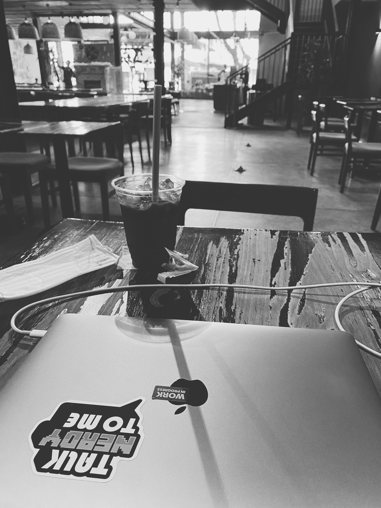

Ngày cuối cùng của năm cũng đã đến, một năm thực sự biến động với chính bản thân mình: nghỉ việc ở công ty, trải nghiệm đi du lịch một mình rồi dịch bệnh khiến mọi kế hoạch đã lên trước đó đều đi vào lòng đất. Tuy nhiên, **2021** có thể gọi là một năm bản lề của mình vì mình đã nhận ra được các thế mạnh của bản thân, hiểu được bản thân phù hợp lối sống như thế nào, xây dựng được một lộ trình để có thể đạt được sự tự do tài chính,...

Giờ mình sẽ review lại những gì mình đã **"learn to earn"** được trong cả năm 2021 vừa rồi

## Hãy trải nghiệm và thử sai

- Mỗi người đều có một cuộc đời để sống và không ai nói trước được ngày mai _(nhất là trong giai đoạn dịch bệnh hiện tại)_, vậy tại sao chúng ta cứ trì hoãn và để thời gian đẹp nhất trôi qua một cách vô nghĩa. Tuy nhiên, trước khi bắt đầu thì hãy tìm hiểu vừa đủ - đủ để biết thế nào là đúng & sai, sau đó là quá trình tích lũy kinh nghiệm hằng ngày.
- **Tại sao lại phải tìm hiểu trước?** Một bài học của bản thân mình: FOMO trong thị trường crypto. Hồi mới tham gia vào thì mình chỉ thích trade theo các kèo trong các room trên TLG. Kết quả là ăn được bao nhiêu thì trả phí cho sàn hết. Sau đó mình ngừng giao dịch một thời gian, đến tháng 10 vừa rồi, mình bắt đầu tìm hiểu lại từ đầu, đọc từng whitepaper của dự án rồi skin in the game. Và mình nhận ra tương lai của Internet chính là Blockchain, là DeFi, là Web3,... (chỗ này hơi hype xíu 😆 nhưng mình nghĩ nếu bạn là 1 developer thì nên tìm hiểu về blockchain và cách nó vận hành)
- Sau khi nghĩ việc full-time ở công ty hồi tháng 4 thì mình có một quyết định táo bạo đó là trải nghiệm việc đi du lịch một mình. Chuyến đi đó không thực sự hoàn hảo nhưng mình tưởng tượng, nếu không muốn nói là **"bad trip"**. Anyway, mình thích không khí lạnh lạnh ở trên Đà Lạt, thích chạy xe qua những con đường, con đèo với cảnh núi rừng xung quanh, nên sau này nếu có chuyện không vui thì mình sẽ lại lên Đà Lạt để "trốn" và đương nhiên sẽ có kinh nghiệm để làm cho chuyến đi thật sự thú vị hơn.
- Việc đặt bản thân vào từng trải nghiệm sẽ biết được bạn có thực sự thích việc đó hay không. Nếu không thích thì cũng hiểu thêm bản thân một tí, còn nếu thích thì chúc mừng bạn đã có thêm một niềm vui mới 👍.

## Lập kế hoạch cuộc đời

- 2021 mình đã học cách xây dựng một "template" cho cuộc sống thịnh vượng theo định nghĩa của mình. Mình cảm thấy "happy" và đủ "an toàn" khi mọi thứ diễn ra theo kế hoạch.
- Mà khoan, dừng khoảng chừng là 2 giây. Ở trên mình nói hãy trải nghiệm, xuống dưới thì lại bảo phải an toàn, hơi mâu thuẫn nhỉ 🤔 (_Thực ra đôi khi mình cũng hay mâu thuẫn vậy đó, chắc vì vậy nên FA tới giờ_ 😂). Nói chứ ý tưởng của mình là: bản kế hoạch cuộc đời giống như một "con đường", ở trên con đường đó sẽ có những "địa điểm" như trường học, mall, quán cafe... chính là những trải nghiệm trong cuộc sống. Nếu bạn chỉ chạy trên con đường để đến đích thì sẽ rất chán và nhạt (như mình vậy đó), nên lâu lâu hãy thử ghé vào "trường" để học thêm gì đó mới, ghé vào "mall" để upgrade cho bản thân đẹp zai hơn 😎,... Tuy nhiên, vấn đề là nếu thả ga quá thì rất có thể ảnh hưởng gián tiếp tới vấn đề tài chính sau này -> cho nên để tránh cho mọi thứ không bị lộn xộn thì hãy lên kế hoạch trước.
- Việc lập kế hoạch cuộc đời không cần phải quá chi tiết vì thực sự rất khó. Bạn chỉ cần viết ra một vài ý tưởng để xây dựng phiên bản tốt nhất của chính mình. Rồi chia nhỏ ý tưởng đó và thực hiện mỗi ngày. Một đích đến có thể có nhiều đường đi, nên nếu đường này đang kẹt thì thử "chặt hẻm" xem. Niềm vui không nằm ở điểm đến mà ở trên chính hành trình ta đi 🏃‍♂️.

## Tự do tài chính

- 2021 là năm mà tài chính mình gặp nhiều sóng gió nhất, là năm mình "kiếm" được nhiều... kiến thức về tài chính.
- Mình đã hiểu được ai cũng có thể đạt được "tự do tài chính" mà không cần phải đâm đầu vào việc đầu cơ, lướt sóng,... rồi suốt ngày nhìn chart mà bỏ qua công việc chính. Điểm máu chốt đó là chi tiêu vừa phải để có một khoản tiền tiết kiệm đều đặn hàng tháng (_để mang tiền về cho mẹ_ 😌) và đầu tư vào bản thân để tối đa nguồn thu nhập.
- Khi dòng tiền đã ổn định thì hãy đầu tư tài chính, tìm các phương pháp đầu tư **dài hạn**, tránh xa các room đầu cơ nếu chưa có kiến thức & kinh nghiệm trên thị trường.

Sang năm 2022, mình sẽ ưu tiên các mục tiêu về sức khỏe và sự nghiệp, đây là hai thứ mình đã bỏ bê trong cả năm rồi. Còn bạn, 2021 của bạn như thế nào?

Lời cuối cùng thì mình chúc cho mọi người luôn khỏe mạnh và bình an trong năm mới. Có sức khỏe là sẽ có tất cả 💪! **Happy New Year 2022 🚀🚀🚀**
