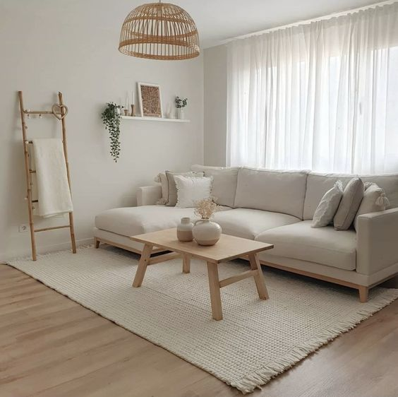

Đã bao giờ bạn cảm thấy mệt mỏi vì xung quanh mình có quá nhiều thứ khiến cho mình phải bận tâm tới.\
Đã bao giờ bạn cảm thấy hứng khởi khi mua một món đó, nhưng sau đó không lâu lại có cảm giác hụt hẫng từ chính món đồ đó.\
Đã bao giờ bạn muốn tịnh tâm lại nhưng chỉ một vài phút sau lại bị sao nhãng đi vì các thông báo trên điện thoại cứ reo liên hồi.\
Nếu như những thứ trên giống với tình cảnh của bạn hiện tại thì bạn không cô đơn đâu, mình cũng thế 🥲

Trong bài viết này, mình sẽ chia sẻ về một lối sống mà mình nghĩ sẽ giúp khắc phục được những vấn đề trên: **LỐI SỐNG TỐI GIẢN - MINIMALISM LIVING**.

## Lối sống tối giản là gì?
Lối sống tối giản là phong cách sống mà người đó thực sự hiểu rõ cái gì cần thiết với mình. Họ sẽ cắt giảm đi những đồ đạc không cần thiết nữa và sẽ có nhiều thời gian cho các sự việc cần thiết như rèn luyện sức khỏe, phát triển bản thân,... 💪

## Sống như thế nào gọi là tối giản?
Người sống tối giản sẽ tận hưởng trọn vẹn cuộc sống của họ. Họ sẽ không so sánh bản thân mình với người khác vì họ hiểu rằng giá trị bản thân chính là giá trị nội tại bên trong mỗi con người. Vật chất xung quanh chỉ là những thứ hào quang thoáng qua.

Họ hiểu bản chất của hệ thần kinh con người là tìm ra sự thay đổi giữa các kích thích (chuyển từ kích thích này sang kích thích khác) và khi cảm thấy quen thuộc với món đồ thì sẽ không còn bị món đồ đó gây kích thích nữa. Dần dần thì món đồ đó sẽ đi vào dĩ vãng. Cho nên, người sống tối giản sẽ lựa chọn kĩ càng và chỉ mua những món đồ cần thiết nhất cho cuộc sống của họ.

## Người mới nên bắt đầu như thế nào?
Tuy nhiên, bạn cần phải hiểu được, với mỗi người khác nhau sẽ có những thứ quan trọng khác nhau, cho nên việc cắt giảm đồ đạc cũng khác nhau. Kinh nghiệm bản thân của mình là nếu bạn đang do dự món đồ đó có cần thiết với mình hay không thì 69.96% câu trả lời là KHÔNG!

Khi bạn muốn mua một món đồ, hãy note lại vào một Wish List, một tuần sau bạn mở ra xem, nếu bạn vẫn muốn mua món đồ đó vì nó rất cần thiết thì hãy mua, còn nếu không thì bạn đã tiết kiệm được kha khá rồi đó. Đừng để cảm xúc nhất thời quyết định hành vi của bạn 😉.

## Tài liệu tham khảo
- Sách "Lối sống tối giản của người Nhật" - Sasaki Fumio
- Phim ["Minimalism: A Documentary About the Important Things"](https://www.netflix.com/title/80114460)

> Hiện tại thì mình cũng chỉ mới bắt đầu tập tành lối sống này nhưng hiệu quả mang lại khá tốt, trước đây thì mình luôn bị stress vì có quá nhiều thứ nhưng giờ mình có thể tập trung hơn vào các việc quan trọng, đồ đạc ít đi cũng làm cho không gian sống mình "dễ thở" hơn 😙. Mình sẽ nói về quá trình mình thực hành lối sống tối giản trong các bài viết tiếp theo.
