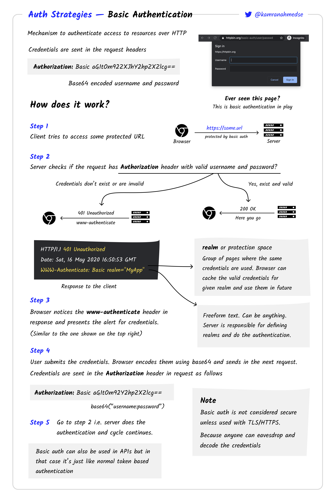
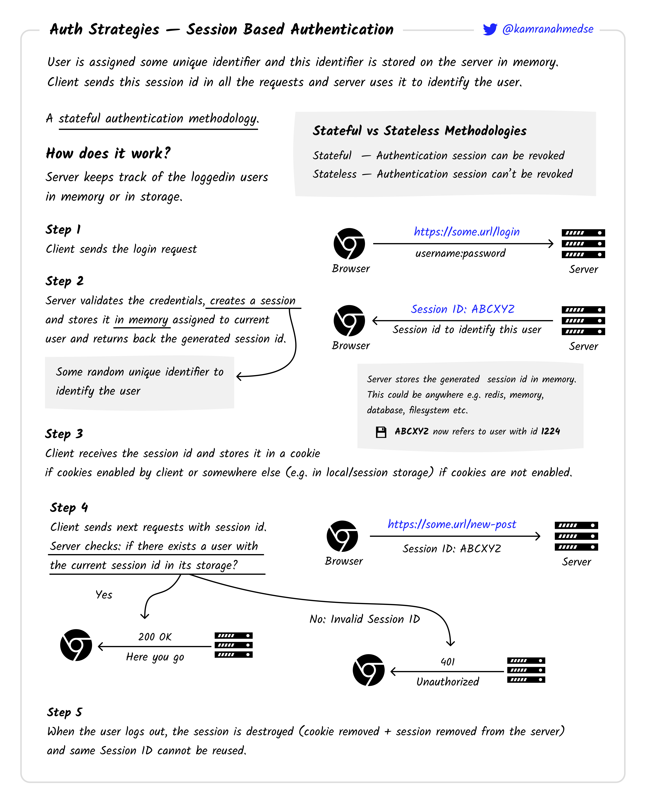
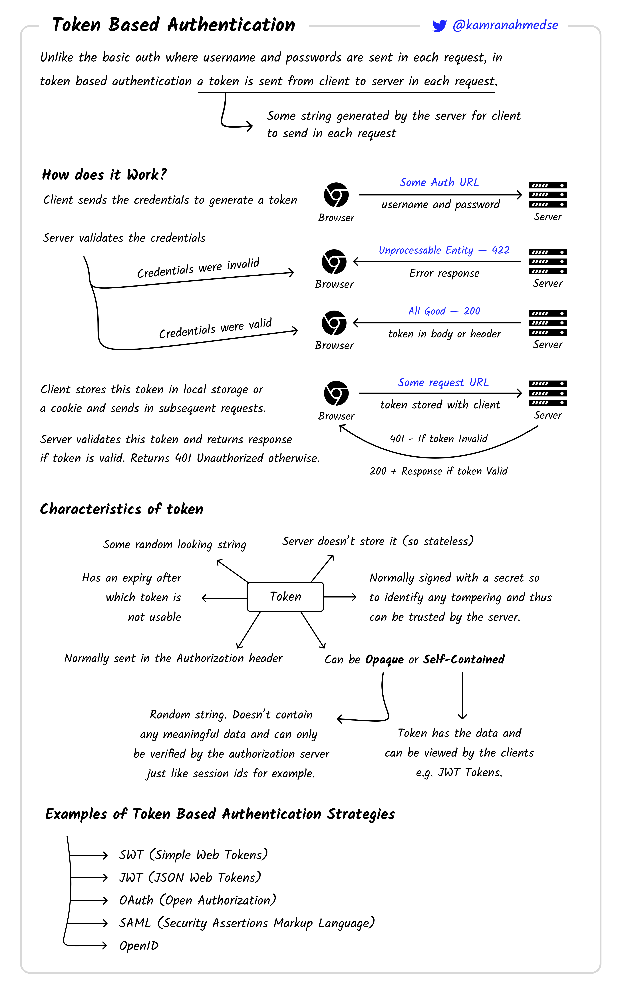
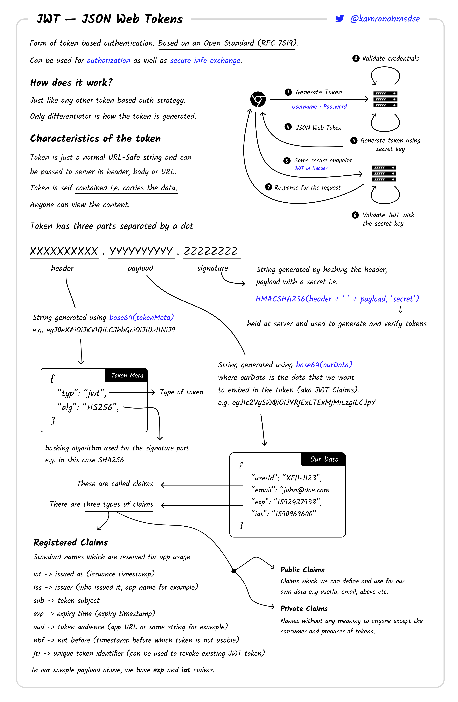
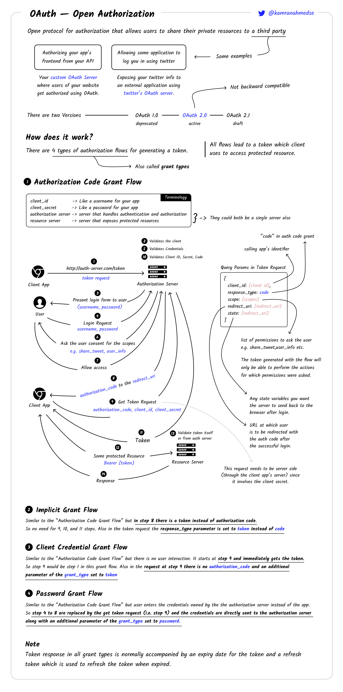
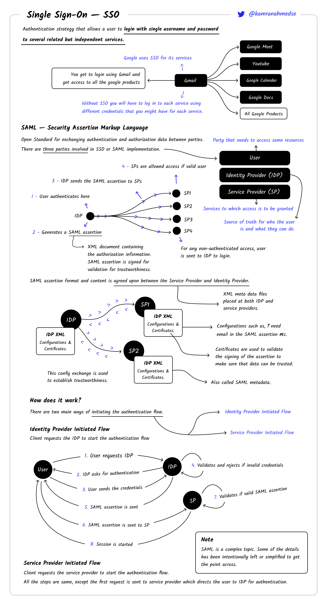

## What is Authentication?

Authentication is the process of identifying users that request access to a system, network, or device. Access control often determines user identity according to credentials like username and password. Other authentication technologies like biometrics and authentication apps are also used to authenticate user identity.

## Authentication Types

#### Basic Authentication

#### Session Based Authentication

#### Token Based Authentication

#### JWT Authentication

#### OAuth — Open Authorization

#### SSO — Single Sign On

Reference: https://roadmap.sh