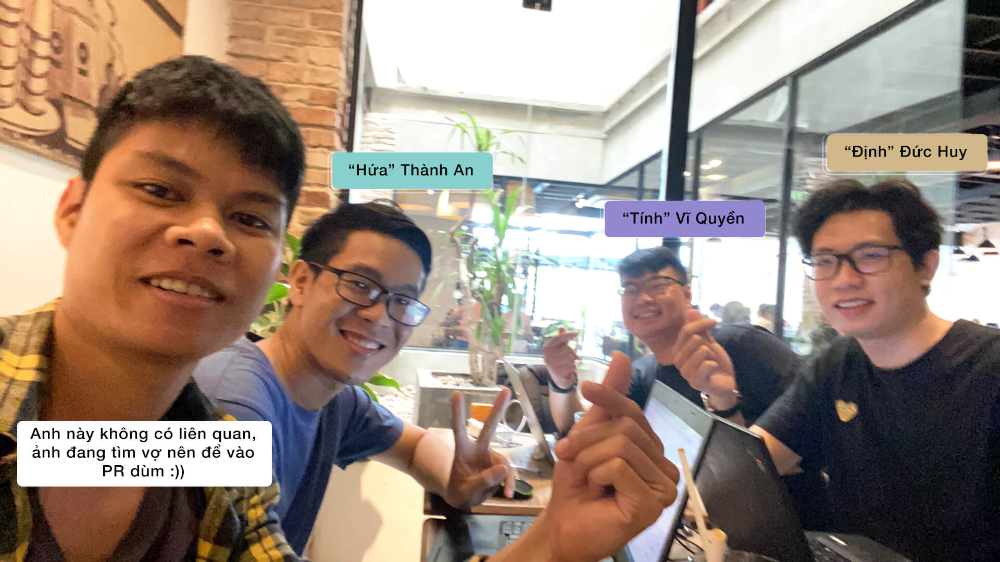
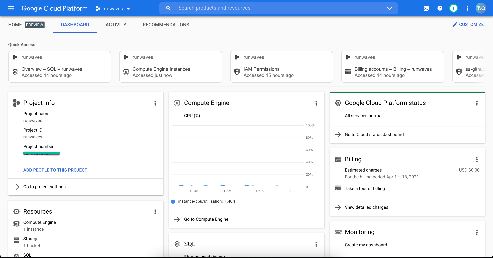
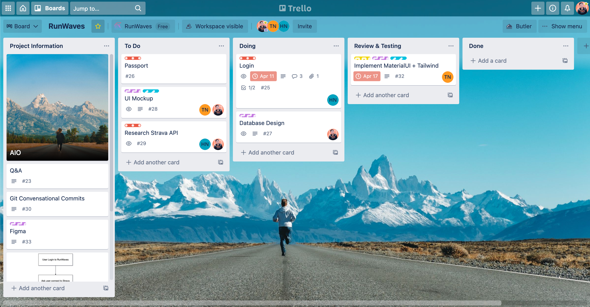

## Cách RunWaves ra đời
- Xuất phát từ ý tưởng xây dựng một trang web dành cho những người bạn yêu thích chạy bộ có thể lưu lại thành tích chạy của mình và cạnh tranh với nhau trên bảng xếp hạng theo tuần và tích lũy.
- Tầm nhìn xa hơn xíu sẽ là một mạng xã hội dành cho người yêu chạy bộ có thể kết nối với nhau, chia sẻ về những kinh nghiệm, trải nghiệm chạy bộ cùng với hệ thống điểm & quà tặng và nhiều tính năng hay ho nữa sẽ bật mí sau.
- Những thành viên đầu tiên của dự án gồm có: ["Tính" Vĩ Quyền](https://tatviquyen.name.vn), ["Hứa" Thành An](https://nguyenthanhan.me), ["Định" Đức Huy](https://www.facebook.com/profile.php?id=100007311435513). Với những cái tên vàng trong làng "tính toán" đã gặp nhau trong một ngày mưa ở Sài Gòn và trao cho nhau những ánh mắt đầy tâm huyết cùng lời thề "code tới cùng" dự án này.
- Hy vọng dự án không bể sớm. 🙏

## Các stack mà team sử dụng
### Platform: Webapp
- Vì cả ba thành viên đều là dân lập trình web nên để có thể bắt đầu thuận lợi tụi mình chọn những stack bên web cho việc phát triển sản phẩm.

### FrontEnd: ReactJs
- Sau khi xem xét stack cho FrontEnd giữa Vue và React thì team quyết định chọn React với hai lý do:
    1. Cả ba có cơ hội làm việc với một stack hoàn toàn mới.
    2. React được tuyển dụng nhiều hơn Vue. 🤣

### BackEnd: Laravel
- Với Laravel thì team đã có kinh nghiệm làm việc qua nhưng mình nhận thấy Laravel là một framework còn rất nhiều thứ hay ho mà tụi mình chưa biết và tận dụng hết nên với dự án này mình quyết định tin dùng Laravel để viết API.
- Bản thân mình rất thích Laravel vì được cập nhật liên tục cũng như docs, code style đúng như slogan của Taylor Otwell đã nói: *"The PHP Framework For Web Artisans"*.

### Cloud Computing: Google Cloud Platform
- Team có sự tài trợ từ một agency GCP nên đã chọn luôn GCP để làm architecture cho dự án.
- Với mình thì đây cũng là một làn gió mới khi suốt một năm vừa qua mình chỉ sử dụng AWS.

### Code Repository: Github
- Tụi mình sẽ public code dự án cho tới khi phiên bản chính thức được ra mắt.
- Nếu bạn có quan tâm thì có thể follow Github của dự án tại: https://github.com/RunWaves

### Project Management: Trello
- Team dùng Trello để note lại những thông tin quan trọng cũng như chia task & theo dõi task.
- Trello có giao diện Kanban board trực quan & dễ nắm được tổng thể dự án, cũng như hỗ trợ khá nhiều plugin miễn phí.
- Với dự án nhỏ thì Trello là một project management app mà tụi mình highly recommend.

> Trong series **RunWaves** này, tụi mình sẽ chia sẻ lại hết toàn bộ những gì đã học & làm được trong suốt quá trình xây dựng sản phẩm. Nhưng với những kinh nghiệm ít ỏi của team thì chắc chắn sẽ còn nhiều thứ chưa được chuẩn chỉ nên tụi mình rất mong nhận được nhiều ý kiến đóng góp từ mọi người thông qua email mình là **tvq9612@gmail.com**. Mỗi một email góp ý đều có giá trị rất lớn với team ạ. 🥰

Cảm ơn bạn đã đọc đến đây và hẹn gặp lại ở bài #2 tiếp theo!
