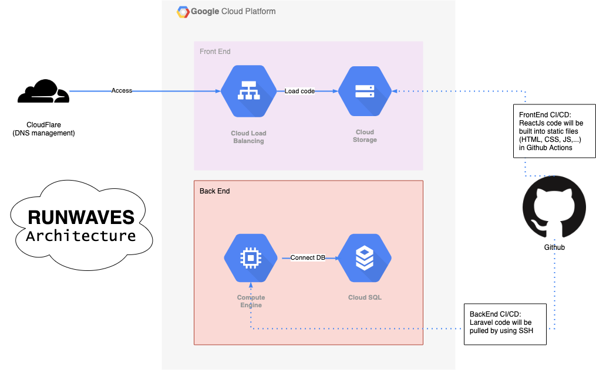
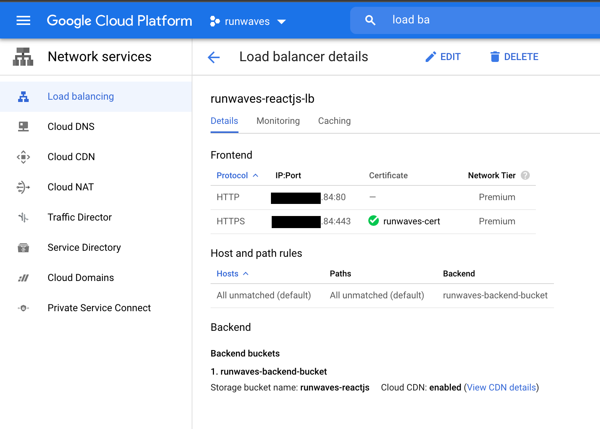
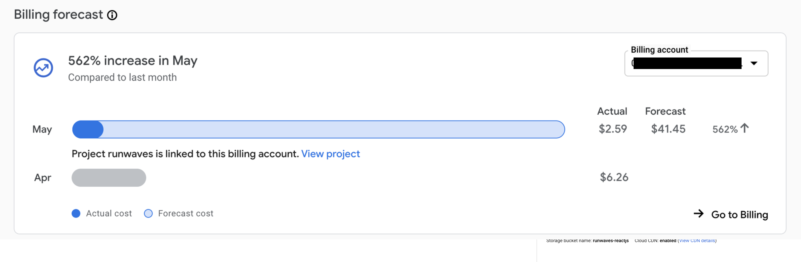

## Architecture Overview

-   Để đơn giản hóa việc deployment và hosting code trên Google Cloud Platform, mình đã nghiên cứu và xây dựng một kiến trúc cloud cơ bản. Ý tưởng là chia ra Front End và Back End thành hai phần tách biệt và sử dụng các service được recommend cho mỗi phần.
-   Đây là sơ đồ về tổng quan kiến trúc và flow chính cho CI/CD.
    

## Front End

-   **GCP services: Cloud Load Balancing, Cloud Storage**
-   **Cloud Storage** là một service cung cấp việc host các static files (ví dụ: HTML, CSS, JS hoặc media, hình ảnh,...). Code ReactJs sau khi build thì cũng là những static files nên mình viết phần build ở Github Actions và upload những file tĩnh đó lên Cloud Storage.
-   Tuy nhiên, để có thể truy cập Cloud Storage như một website và sử dụng giao thức HTTPS, mình cần dùng thêm **Cloud Load Balancing** để tạo một CDN. Sau khi tạo LB xong sẽ được cấp một IP, công việc tiếp theo là vào **CloudFlare** trỏ domain FE vào IP này (easy game 😎).
    
-   Đây là **Github Actions Workflow** cho repo [ReactJs](https://github.com/RunWaves/reactjs), mỗi khi dev push code hoặc merge vào branch `develop` thì Action này sẽ được trigger để build và upload lên Cloud Storage.

    ```yml
    name: ReactJs Deploy

    on:
        push:
            branches:
                - develop
        pull_request:
            branches:
                - develop

    jobs:
        build:
            runs-on: ubuntu-latest
            steps:
                - uses: actions/checkout@v2

                - name: Setup Node.js # setup Node.js in the runner
                uses: actions/setup-node@v1
                with:
                    node-version: "12"
                - uses: actions/cache@v2
                with:
                    path: ~/.npm
                    key: ${{ runner.os }}-node-${{ hashFiles('**/package-lock.json') }}
                    restore-keys: ${{ runner.os }}-node-
                - run: npm ci # install dependencies
                - run: npm run build --if-present # build the project
                # - run: npm run test:unit # run the tests

                - name: Setup - gcloud / gsutil
                uses: google-github-actions/setup-gcloud@master
                with:
                    service_account_key: ${{ secrets.GCS_SA_KEY }}
                    project_id: ${{ secrets.GCS_PROJECT }}
                    export_default_credentials: true

                - name: Deploy static site to GS bucket
                run: |-
                    gsutil -m rsync -r build gs://${{ secrets.GCS_BUCKET }}
    ```

## Back End

-   **GCP services: Compute Instance, Cloud SQL**
-   Đối với phần code backend, cụ thể là Laravel, mình chọn deploy lên một **Virtual Machine (VM)** với setup **Nginx + PHP + Composer**.
-   Database thì mình dùng **Cloud SQL** để chạy riêng một MySQL server, giảm tải phần xử lý DB cho server backend ở trên.
-   **Github Actions Workflow** cho repo [Laravel](https://github.com/RunWaves/api)

    ```yml
    name: Laravel Deploy

    on:
        push:
            branches:
                - develop
        pull_request:
            branches:
                - develop

    jobs:
        build:
            runs-on: ubuntu-latest
            steps:
                - uses: actions/checkout@v2

                - name: Executing remote ssh commands
                uses: appleboy/ssh-action@master
                with:
                    host: ${{ secrets.SERVER_IP }}
                    username: ${{ secrets.SERVER_USERNAME }}
                    key: ${{ secrets.KEY_SSH }}
                    script: |
                        cd /opt/runwaves-api
                        php artisan down
                        git pull origin develop
                        php artisan optimize:clear
                        composer install --optimize-autoloader --no-dev
                        php artisan optimize
                        php artisan up
    ```

## Billing

-   Cấu hình cho các service trên cũng khá cơ bản và chi phí một tháng rơi vào tầm **$40 - $45**.
    

> Trong series **RunWaves** này, tụi mình sẽ chia sẻ lại hết toàn bộ những gì đã học & làm được trong suốt quá trình xây dựng sản phẩm. Nhưng với những kinh nghiệm ít ỏi của team thì chắc chắn sẽ còn nhiều thứ chưa được chuẩn chỉ nên tụi mình rất mong nhận được nhiều ý kiến đóng góp từ mọi người thông qua email mình là **tvq9612@gmail.com**. Mỗi một email góp ý đều có giá trị rất lớn với team ạ. 🥰

Hai bài đầu tiên trong series này mình chỉ mới giới thiệu tổng quan về RunWaves, những bài tiếp theo mình sẽ đi sâu hơn vào technical của từng vấn đề. Hẹn gặp lại ở bài #3 👋!
